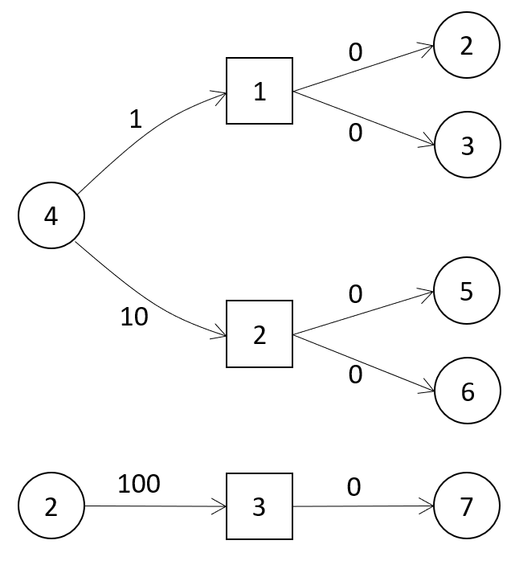
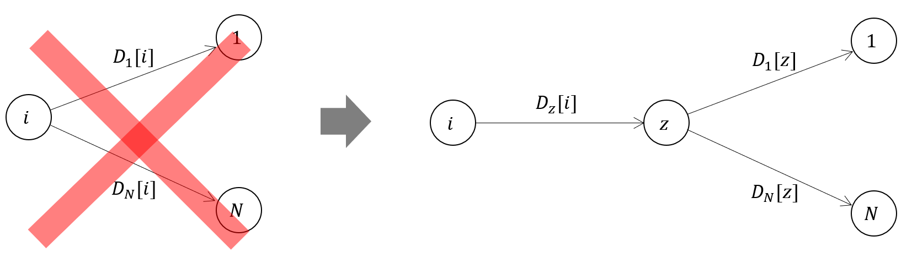

## 基本アイデア
1. checkpointとticketを共に１つのgraphで表現する。下図で、丸はcheckpoint、四角はticketを表す。エッジのコストは、ticket購入価格。
2. 作成したgraphに対して、Dijkstraアルゴリズムでcheckpoint iからcheckpoint 1までの距離 D_1[i]を計算する。
3. 同様にして、checkpoint iから checkpoitn Nまでの距離 D_N[i]を計算する。

しかし、D_1[i] + D_N[i]では、一部区間のコストが重複して含まれているため、求めたい最短距離ではない。

## 重複を除外するために？
checkpoint iからcheckpoint zまでは、D_1[i]、D_N[i]ともに含んでいるとすると、求めたい距離は、D_z[i] + (D_1[z] + D_N[z])ということだ。

したがって、以下のように求められる。
1. まずは基本アイデアを使って、(D_l[i] + D_N[i])を計算する。
2. 各checkpointのコストを1の結果で初期化し、再度、Dijkstraアルゴリズムでcheckpoint iのコストを計算する。この結果、checkpoint iのコストは下がる可能性がある。

## Dijkstraでは遅い！
通常のDijkstraでは、遅い！O(N logN)を実現したい。そこで、ticketを使ってsegment treeを使用する。
1. 各ticketのcheckpoint範囲の最小値を使ってticketをソートする。同じ最小値の場合は、さらに最大値でソートする。そして、ticketのsegment treeを作成する。segment treeの各ノードには、そのサブツリーのcheckpoint範囲を格納する。こうすることで、checkpoint iを含むticketを効率的に探すことができる。
2. Priority queueに全てのcheckpointを初期コストと共に格納する。
3. Priority queueから、checkpoint iとそのコストC[i]を取り出す。
4. Segment treeを使って、checkpoint iを含むticketを探す。
5. 探した各ticketを購入できるcheckpoint jと、購入価格pが分かっているので、checkpoint jのコストをC[i]+pとして更新し、priority queueに入れる。
6. さらに、探した各ticketの範囲を最大値を-1にし、segment treeを更新する。
7. 3へ戻る。
