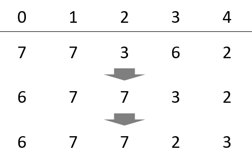
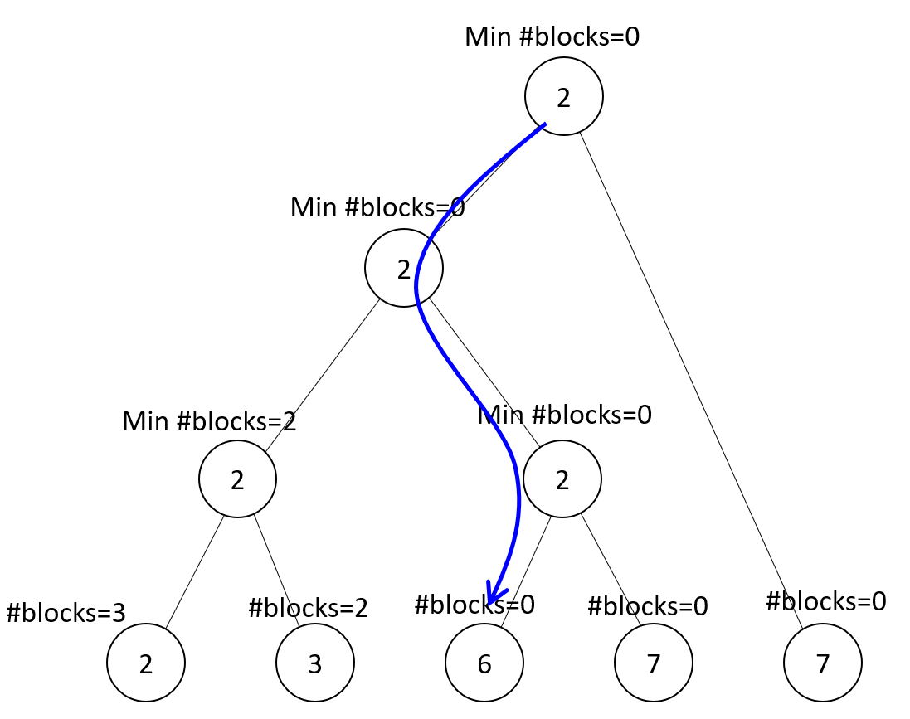

## 基本アイデア
1. 一番左に移動できる最小のheightを探し、それを一番左に移動する。これにより、一番左のheightは決定。
2. 同様に、左から２番目に移動できる最小のheightを探し、左側から２番目のheightを決定。
3. 以下、同様。

しかし、これでは、O(N^2)となり、遅い。そこで、segment tree用意し、heightをソートして入れておく。
Segment treeのノードには、2つの情報を入れる。heightをブロックしているheightの数の最小値、そして、heightの最小値。

1. Sement treeを使って、ブロック数が0の最小heightを探す。
2. 探したheightのブロック数を無限に変更し、segment treeを更新する。
3. 探したheightから+-Kのheightについて、ブロック数を1減らす。
4. 1に戻る。

